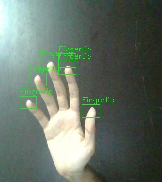

Setting up the project on your system:

- Install the required packages using `pip install -r requirements.txt`
- Clone this git repository to your system
- Download trained weights from [here](https://drive.google.com/file/d/1b1XnsY0nOtj4GukKTpjq2UcWMFg-B6Zj/view?usp=sharing) into the weights folder
- In file detector.data (in requirements folder) replace the path to the objects.name to that according to your system in names field
- Go to the project directory and clone the darknet repository [GitHub](https://github.com/AlexeyAB/darknet)
- cd into the darknet repository, then
  - If you want to give gpu and cudnn access to the model then run the following two commands on terminal:
    `sed -i 's/GPU=0/GPU=1/' Makefile`
    `sed -i 's/CUDNN=0/CUDNN=1/' Makefile`
  - Give opencv access by `sed -i 's/OPENCV=0/OPENCV=1/' Makefile`
  - Run `make`
  - Run the command `sed -i 's/.\/libdarknet.so/.\/darknet\/libdarknet.so/g' darknet.py`

For running the model then go to the previous directory `cd ..`

Run the following commands as per their use:

- For running model on an image run `python image_detection.py --imagepath`
  - where `imagepath` is path to image you want to run the detection on
  - the resultant image is saved as "filename_output.jpg" in the detections folder
  - An example image "image.jpg" has been provided in example folder
- For running model on a video, run `python video_detection.py --videopath`
  - where `videopath` is path to vidoe you want to run the detection on and
  - the resultant video is saved as "filename_output.avi" in the detections folder
  - An example video "video.webm" has been provided in example folder
- For running live detection from webcam, run `python webcam_detection.py` //would suggest using gpu for this one
